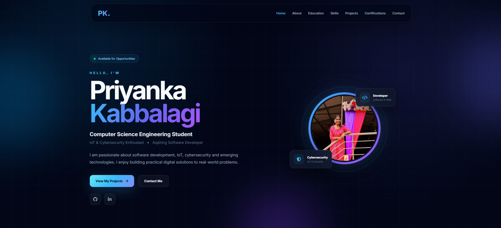

# 💼 Priyanka Kabbalagi – Personal Portfolio

## Oasis Infobyte Web Development Internship

### Task 2 – Personal Portfolio

A modern and responsive personal portfolio website created to showcase my professional profile, technical skills, projects, certifications, and contact information.

The portfolio features a clean, attractive, and modern interface with a 3D-inspired visual style, smooth navigation, animations, and responsive design for desktop, tablet, and mobile devices.

---

## 🌐 Live Demo

🚀 **[View My Portfolio](http://127.0.0.1:5500/index.html)**

> This is the local development link using VS Code Live Server.

---

## 🖼️ Project Preview

## 🖼️ Project Preview

<p align="center">
  
</p>

## 👩‍💻 About Me

Hi, I'm **Priyanka Kabbalagi**, a Computer Science Engineering student with interests in **Web Development, IoT, Cybersecurity, Artificial Intelligence, and emerging technologies**.

I enjoy building practical digital solutions, learning new technologies, and developing user-friendly applications to solve real-world problems.

---

## ✨ Features

- 🎯 Professional hero section
- 👩‍💻 Personal profile information
- 📖 About Me section
- 🎓 Education section
- 💻 Technical Skills section
- 🚀 Projects showcase
- 📜 Certifications section
- 📞 Contact section
- 🔗 GitHub link
- 🔗 LinkedIn link
- 🖼️ Profile photo
- ✨ 3D-inspired visual design
- 🎨 Modern dark UI
- 🌀 Smooth scrolling navigation
- ✨ Hover animations
- 📱 Fully responsive design
- 💻 Desktop and mobile compatibility

---

## 🛠️ Technologies Used

- HTML5
- CSS3
- JavaScript
- Google Fonts
- Responsive Web Design

---

## 💻 Technical Skills

### Programming Languages

- C
- Python
- JavaScript

### Web Technologies

- HTML
- CSS
- JavaScript

### Areas of Interest

- Web Development
- Internet of Things (IoT)
- Cybersecurity
- Artificial Intelligence
- Machine Learning
- Blockchain

---

## 🚀 Projects

### 🧴 Smart Skin Disease Detection and Recommendation System Using AI

An AI-based project designed to analyze skin disease images and provide disease prediction, severity analysis, and suitable recommendations.

#### Key Features

- Image-based skin disease detection
- Severity analysis
- Allopathic recommendations
- Ayurvedic recommendations
- Home remedies
- Multilingual support
- Educational information
- Diet and lifestyle guidance
- Doctor consultation support

---

### 📚 Snap & Study

An AI-powered study application that allows students to upload images of notes or questions and interact with an AI study assistant.

#### Key Features

- Image-based question analysis
- AI study assistance
- Interactive chat
- Study summaries
- Student-friendly interface

---

## 🎨 Design

The portfolio uses a modern and attractive design featuring:

- 3D-inspired elements
- Dark futuristic interface
- Blue and purple accent colors
- Modern typography
- Smooth animations
- Interactive hover effects
- Glass-style UI elements
- Clean card-based layouts
- Responsive sections

---

## 📱 Responsive Design

The website is designed to work across different screen sizes:

- 💻 Desktop
- 💻 Laptop
- 📱 Tablet
- 📱 Mobile

The layout automatically adapts to different screen sizes using responsive CSS.

---

## 📂 Project Structure

```text
WebDev-L1-Personal Portfolio
│
├── index.html
├── style.css
├── script.js
├── README.md
│
└── images
    └── portfolio.png
