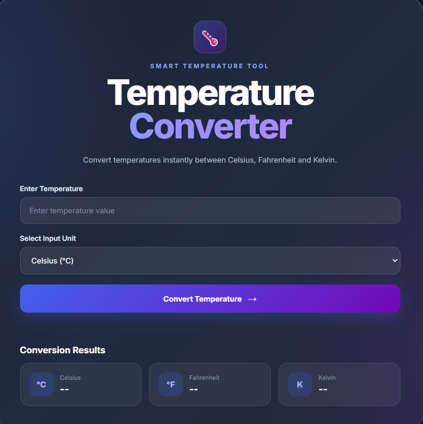

# 🌡️ Temperature Converter

## Oasis Infobyte Web Development Internship

### Task 3 – Temperature Converter

Temperature Converter is an interactive and responsive web application that allows users to convert temperature values between **Celsius, Fahrenheit, and Kelvin**.

The project is developed using HTML5, CSS3, and JavaScript with a modern glassmorphism-inspired user interface.

---

## 🖼️ Project Preview

<p align="center">
  
</p>
---

## ✨ Features

- Enter a temperature value
- Select the input unit
- Convert between Celsius, Fahrenheit, and Kelvin
- Display all converted values simultaneously
- Numeric input validation
- Empty input validation
- Absolute zero validation
- User-friendly error messages
- Responsive design
- Modern glassmorphism UI
- Interactive conversion button
- Press Enter to perform conversion

---

## 🔄 Supported Conversions

### Celsius

```text
Fahrenheit = (Celsius × 9/5) + 32
Kelvin = Celsius + 273.15
